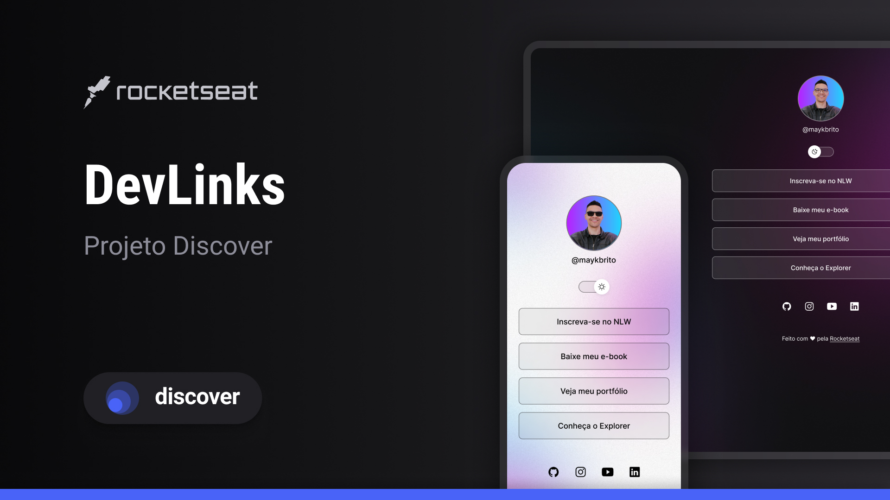

<h1 align="center"> DevLinks </h1>

 projeto exclusivo e gratuito, promovido pela Rocketseat para ensino de tecnologias WEB.

  <a href="#-tecnologias">Tecnologias</a>&nbsp;&nbsp;&nbsp;|&nbsp;&nbsp;&nbsp;
  <a href="#-projeto">Projeto</a>&nbsp;&nbsp;&nbsp;|&nbsp;&nbsp;&nbsp;
  <a href="#-layout">Layout</a>&nbsp;&nbsp;&nbsp;|&nbsp;&nbsp;&nbsp;
  <a href="#memo-licença">Licença</a>

  

 

  

## 🚀 Tecnologias

Esse projeto foi desenvolvido com as seguintes tecnologias:

- HTML e CSS
- JavaScript
- Git e Github
-figma

## 💻 Projeto

DevLinks é um agrupamento de links para usar como cartão de visitas oline. 

## 🔖 Layout

Você pode visualizar o layout do projeto através [DESSE LINK](https://www.figma.com/design/ed1ESMhGXNAwW42xEgoMp8/DevLinks-%E2%80%A2-Projeto-Discover--Community-?node-id=1437-191&t=NVA7iWz4z3e4vpi3-0). É necessário ter conta no [Figma](https://figma.com) para acessá-lo.

## :memo: Licença

Esse projeto está sob a licença MIT.

---
## aprendizados com o projeto
Aprendi a exportar projetos para a internet, entender a ideia de funcionamento do JavaScript, HTML e CSS, adicionar imagens, divs e outros elementos às páginas. Também aprendi como o cérebro aprende e conheci técnicas de estudo que ajudam no aprendizado. Além disso, aprendi a utilizar Inteligência Artificial no gerenciamento de projetos e como ela pode auxiliar no desenvolvimento.

Feito com ♥ by Rocketseat :wave: [Participe da nossa comunidade!](https://discord.gg/rocketseat)
